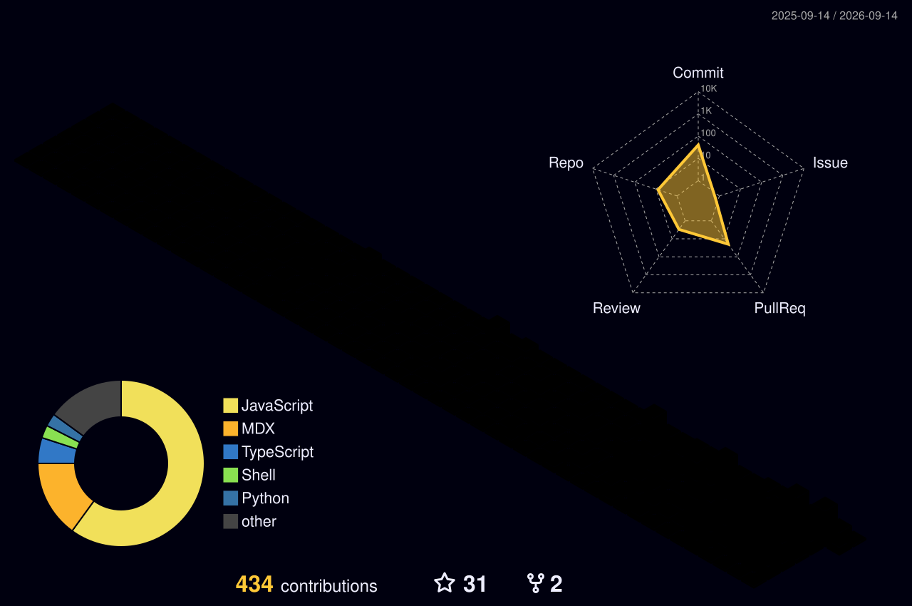

<div align="center">

<a href="https://tashvik.com">
  
</a>

<br/><br/>

<a href="https://www.linkedin.com/in/tashvik"></a>
<a href="https://tashvik.com"></a>
<a href="mailto:tashviksrivastava@gmail.com"></a>
<a href="https://codeforces.com/profile/tsvk"></a>
<a href="https://www.codechef.com/users/tashvik"></a>
<br/>


</div>

---

## 🧠 whoami

```go
package main

type Engineer struct {
    Name     string
    Role     string
    Company  string
    Base     string
    Stack    []string
    Building []string
}

func main() {
    me := Engineer{
        Name:     "Tashvik Srivastava",
        Role:     "Founding Engineer",
        Company:  "Linkrunner",
        Base:     "Bengaluru, India 🇮🇳",
        Stack:    []string{"Golang", "gRPC", "Kafka", "PostgreSQL", "React Native", "Agentic AI"},
        Building: []string{"attribution infra at scale", "AI agents with production ownership"},
    }
    _ = me // ship it 🚀
}
```

- 🛰️ **Founding Engineer @ Linkrunner** — attribution & analytics infra: Go services, Kafka pipelines, ClickHouse-scale event data.
- 🏗️ **ex-Infra.Market (Unicorn)** — SE-1 on the Phoenix Ops Hub team; owned the order lifecycle end-to-end.
- ⚡ Cut query latency ~**100%** across Order/OMS services · dropped ML infra cost ~**65%** on SageMaker.
- 🤖 Trained + shipped **YOLOv8** invoice/POD validation straight into a Golang business-logic pipeline.
- 🏆 **Winner — IM-HAX 2025** · **Winner — Experian Hackathon 2024** · **Top 330 — Flipkart Grid 6.0**
- 🎓 B.Tech CSE, LPU (2021–2025) · E-Cell IIT Madras · GDSC LPU

---

## 🛠️ The Arsenal

<div align="center">

**Languages**


**Backend · Data · Messaging**


**Frontend · Mobile**


**Cloud · Infra · Observability**


<sub>also fluent in: <b>gRPC</b> · <b>ClickHouse</b> · <b>Agentic AI / RAG</b> · <b>Transformers</b> · <b>New Relic</b> · <b>SageMaker</b> · <b>BigQuery</b></sub>

</div>

---

## 🚀 Things I've Built

<div align="center">

| Project | What it is | Stack |
| :-- | :-- | :-- |
| **[Peerdrop](https://github.com/tashviks/peerdrop)** | Serverless P2P file transfer — files never touch a server, AES-256-GCM in the browser | `WebRTC` `Crypto` `TS` |
| **[DEX Order Execution Engine](https://github.com/tashviks/dex-order-execution-engine)** | Market-order routing across Raydium & Meteora on Solana, realtime status over WS | `Solana` `TS` `WebSockets` |
| **[On-Call Agent](https://github.com/tashviks/On-Call-Agent)** | AI agent that reads logs/metrics, triages errors, pings humans, files Jira tickets | `Python` `Agents` `Jira` |
| **[tashGPT](https://github.com/tashviks/tashGPT)** | An AI portfolio you can *talk to* instead of scroll | `TS` `React` `LLM` |
| **[Closed-Claw](https://github.com/tashviks/Closed-Claw)** | Agentic task-automation tool, Clawdbot-style | `Python` `Agentic AI` |
| **[Port Sniffer](https://github.com/tashviks/Port-Sniffer-Rust)** | Multi-threaded port scanner, written while learning Rust | `Rust` `tokio` |

</div>

---

## 📊 Stats That Move

<div align="center">


<br/>


<br/><br/>


<br/>


<br/>


</div>

---

## 🌍 My Contributions, in 3D

<div align="center">
  
</div>

---

<div align="center">
  <h2>🐍 ...and the snake that eats them 🐍</h2>
  <br>
  <picture>
    <source media="(prefers-color-scheme: dark)" srcset="https://raw.githubusercontent.com/tashviks/tashviks/output/github-user-contribution-dark.svg" />
    <source media="(prefers-color-scheme: light)" srcset="https://raw.githubusercontent.com/tashviks/tashviks/output/github-user-contribution.svg" />
    
  </picture>
  <br/><br/>
</div>

---

## 🤝 Let's build something

<div align="center">

I'm always up for a conversation about **distributed backends**, **attribution at scale**, or **agents that do real work**.

<a href="mailto:tashviksrivastava@gmail.com"></a>
<a href="https://www.linkedin.com/in/tashvik"></a>

<br/><br/>

<i>"Talk is cheap. Show me the code." — Linus Torvalds</i>

</div>


